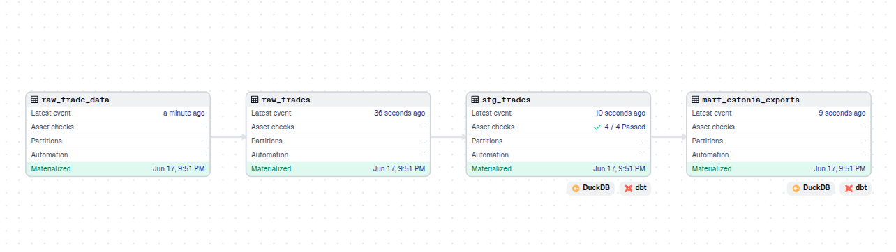

# Trade Pipeline

[](https://github.com/AleDorosh/trade-pipeline/actions/workflows/test.yml)

Does Estonia's export data, pulled straight from a public trade API, hold up to a proper ELT treatment - extraction, loading, transformation, testing, and orchestration - using the same tool categories a production data team would reach for?

---

## Terms

| Term | Meaning |
|---|---|
| ELT | Extract, Load, Transform - raw data is loaded into the database before being cleaned or aggregated, as opposed to ETL where transformation happens first. |
| Asset (Dagster) | A piece of data produced by a pipeline stage - a file, a database table, or a view. Dagster tracks dependencies between assets, not just the code that produces them. |
| Source (dbt) | A dbt declaration pointing at a table that exists outside dbt's own models - in this case, `raw_trades`, created by the load script. |
| HS code (commodity code) | Harmonized System code - an internationally standardised numeric classification for traded goods. |
| Partner country | The country a reported trade was conducted with. Coded numerically by Comtrade (e.g. `276` = Germany). |
| Materialize (Dagster) | To actually run an asset's code and produce its output, as opposed to just defining it. |

---

## What this is

An ELT pipeline built on UN Comtrade trade data, covering Estonia's reported exports. Raw data is extracted via API, loaded untransformed into DuckDB, then cleaned, tested, and aggregated with dbt. Dagster orchestrates all stages as a single dependency graph and runs the pipeline on a daily schedule.

Built as a portfolio project.

---

## The question

**What does Estonia export, to which countries, and at what value?**

Scope: Estonia's reported export trade flows (flow code `X`) for the year 2025, sourced directly from the UN Comtrade public API. Import flows, other countries, and other years are not included in the current run, though the pipeline is parameterized to support them. Records representing aggregate "World" totals rather than a specific partner country are excluded from the final mart.

The final mart table (`mart_estonia_exports`) aggregates the remaining records by commodity code and partner country, ranked by total trade value in USD.

---

## Architecture

```
UN Comtrade API → extract.py → data/raw/*.json → load.py → DuckDB (raw_trades)
                                                                  │
                                                                  ▼
                                                    dbt: stg_trades (cleaned, tested)
                                                                  │
                                                                  ▼
                                                    dbt: mart_estonia_exports (aggregated)
```

All four stages run as a single connected Dagster asset graph:



---

## Pipeline stages

| Stage | Tool | What it does |
|---|---|---|
| Extract | Python (`requests`) | Pulls annual export data from the UN Comtrade public API. Saves the raw, untouched JSON response to `data/raw/` with a datestamped filename. |
| Load | Python (`pandas`, `duckdb`) | Reads the most recent raw JSON file, loads it into a DuckDB table (`raw_trades`) with no transformation. |
| Transform | dbt | A staging model (`stg_trades`) selects and renames the relevant columns. A mart model (`mart_estonia_exports`) aggregates trade value by commodity and partner country. |
| Test | dbt | Four data quality tests on the staging model - not-null checks on key identifier columns, and an accepted-values check constraining trade direction to export (`X`) or import (`M`). |
| Orchestrate | Dagster | All stages modeled as one dependency graph. An upstream failure stops downstream stages from running on incomplete or missing data. |
| Schedule | Dagster | Daily run at 06:00 UTC. |

---

## Continuous Integration

This repo uses **GitHub Actions** to automatically verify the pipeline on every push to `main`. Each run starts from a completely clean machine — no cached state, no leftover files — and reproduces the full cold-start sequence: install dependencies, generate a dbt profile, parse the dbt project, materialize the Dagster assets (building the raw trade data), then run `dbt build`, which builds both models and runs all 4 data quality tests.
A green badge means the most recent push passed this full sequence on a fresh environment.

---

## Snowflake Integration (Cloud Warehouse Variant)

This project runs identically against two backends: **DuckDB** (the default, local, file-based target) and **Snowflake** (a real cloud data warehouse, added to demonstrate hands-on cloud experience). Both are driven by the same dbt project — no duplicated models, no forked codebase. Credentials for Snowflake are never committed — they're read from environment variables (`SNOWFLAKE_ACCOUNT`, `SNOWFLAKE_USER`, `SNOWFLAKE_PASSWORD`, `SNOWFLAKE_ROLE`) via dbt's `env_var()`.

### Running against each target

```bash
dbt build --target dev            # DuckDB (default)
dbt build --target snowflake_dev  # Snowflake
```
---

## Design decisions

| Decision | Reasoning |
|---|---|
| 7 of 47 source columns kept | The raw API response includes fields irrelevant to the question at hand (estimation flags, legacy codes, alternate quantity units). The staging model retains only reporter, partner, flow direction, year, commodity, value, and weight. |
| Aggregate "World" rows excluded from the mart | Comtrade reports `partnerCode = 0` for total exports across all partners combined. These rows are filtered out so partner-level totals aren't double-counted alongside the aggregate. |
| No country/commodity name lookups | Partner and commodity fields remain numeric codes (e.g. partner `276`, commodity `441233`). The Comtrade endpoint used does not return reference labels, and building a separate code-to-name mapping table was left out of scope. |
| Single country, single year | `extract.py` is parameterized by country and year as constants, currently set to Estonia / 2025. Multi-country or multi-year extraction is a structural extension, not a rework. |
| No cloud deployment | The pipeline runs entirely locally. Persistent, unattended deployment is treated as a separate concern from the pipeline logic itself. |

---

## Limitations

| Limitation | Detail |
|---|---|
| Schedule requires an active process | The Dagster schedule only fires while `dagster dev` is running on the host machine. It is not a persistent, always-on deployment. |
| Schedule time is UTC | 06:00 UTC corresponds to 09:00 Tallinn time in summer, 08:00 in winter. Dagster cron schedules default to UTC. |
| No row-level deduplication | A country can legitimately report the same partner, commodity, and value more than once in a given year. No natural unique key exists at the row level, so none is enforced. |
| Errors halt rather than retry | `extract.py` and `load.py` fail loudly and stop the pipeline on error rather than retrying - suited to a daily batch job, not a high-availability system. |
| SQL logic has no static validation | A dbt model's correctness (column names, joins) can only be confirmed by running it against the live database. `dbt run` and direct DuckDB queries served as the fast feedback loop during development. |

---

## Stack

Python · DuckDB · dbt-core (dbt-duckdb adapter) · Dagster · pandas · GitHub Actions

DuckDB stands in for a cloud data warehouse - same SQL-based analytical model, no infrastructure cost. dbt and Dagster are used as themselves, not substitutes, since both run fully locally at no cost.

---

## Repo structure

```
trade-pipeline/
│
├── data/                      # gitignored - created at runtime
│   ├── raw/                    # raw JSON snapshots from the API
│   └── db/                     # DuckDB database file
│
├── ingest/
│   ├── extract.py               # Extract stage
│   └── load.py                  # Load stage
│
├── transform/
│   └── trade_transform/         # dbt project - staging + mart models, tests
│
├── orchestrate/
│   ├── assets.py                 # Dagster asset, job, and schedule definitions
│   └── definitions.py            # Dagster entry point
│
├── requirements.txt
└── README.md
```

---

## Author

Aleksandra Doroshenko 

---

## Acknowledgement

AI tools were used during development to introduce dbt and Dagster, explain concepts, and guide debugging - including a dependency mismatch between dbt's source naming and Dagster's asset keys. All pipeline design, code, and configuration were written and validated by the author.

---

## Running it

```bash
git clone https://github.com/AleDorosh/trade-pipeline.git
cd trade-pipeline

python3 -m venv venv
source venv/bin/activate
pip install -r requirements.txt
```

dbt profile (`~/.dbt/profiles.yml`) needs to point at the local repo path:

```yaml
trade_transform:
  outputs:
    dev:
      type: duckdb
      path: <absolute-path-to-repo>/data/db/trades.duckdb
      threads: 1
  target: dev
```

Full pipeline, via Dagster:

```bash
cd orchestrate
dagster dev -f definitions.py
```

Open `http://127.0.0.1:3000`, click Materialize all.

Individual stages:

```bash
python3 ingest/extract.py
python3 ingest/load.py
cd transform/trade_transform
dbt build
```
